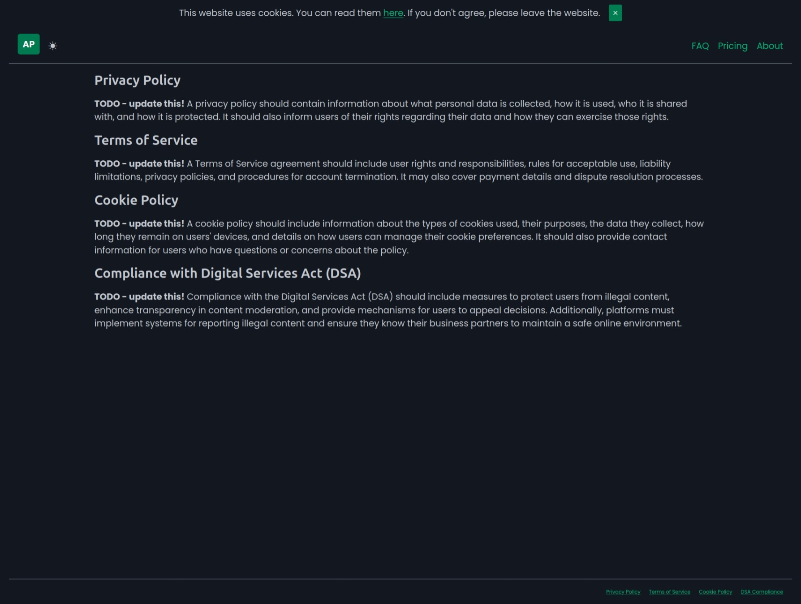

# 📦 Django Starter

A basic Django boilerplate with [picocss](https://picocss.com/), [alpinejs](https://alpinejs.dev/) + some opinionated configurations.

Features:
- Landing, 404, 500, Legal pages;
- Dockerized;
- [Caddy proxy](https://caddyserver.com/);
- SEO sitemap.xml setup;
- Templates hot reload (django-browser-reload);

## Quickstart

In development:

- clone repo;
- uv sync;
- create the .env file;
- make migrate;
- make dev (app at: http://localhost:8000/);

In production:

- update Caddyfile with your domain;
- docker network create web (one-time);
- switch DEBUG to 0;
- make collectstatic;
- make build;
- make start (app at: http://app.localhost);
- make stop;
- make applogs;
- make proxylogs;

> NOTE: If you need google sign in or external storage on Cloudflare R2 checkout this [repo](https://github.com/ClimenteA/social-media-posts-scheduler) 

## Landing page

Customize it for your needs.

## Legal page

Update these sections.

